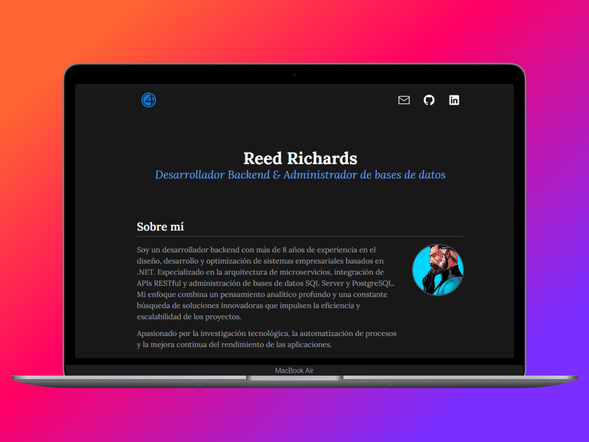
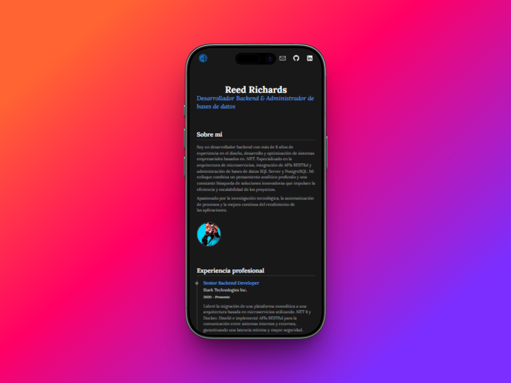
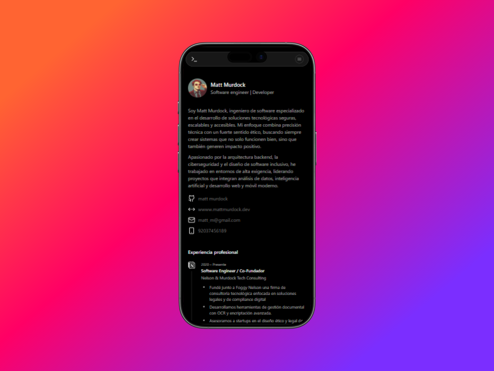

# Portfolio Templates Collection

Colección de plantillas de portfolios profesionales construidas con diferentes frameworks modernos. Cada proyecto está optimizado para deployment en Netlify y diseñado con las mejores prácticas de desarrollo web.

## Tabla de Contenidos

### Portfolio Astro
- [Características](#características-astro)
- [Capturas](#capturas-astro)
- [Demo](#demo-astro)
- [Tecnologías](#tecnologías-astro)
- [Cómo Usar](#cómo-usar-astro)
- [Agradecimientos](#agradecimientos-astro)

### Portfolio React
- [Características](#características-react)
- [Capturas](#capturas-react)
- [Demo](#demo-react)
- [Tecnologías](#tecnologías-react)
- [Cómo Usar](#cómo-usar-react)
- [Agradecimientos](#agradecimientos-react)

### Portfolio Angular
- [Características](#características-angular)
- [Capturas](#capturas-angular)
- [Demo](#demo-angular)
- [Tecnologías](#tecnologías-angular)
- [Cómo Usar](#cómo-usar-angular)
- [Agradecimientos](#agradecimientos-angular)

---

## Portfolio Astro

### Características (Astro)

- ⚡ Rendimiento ultra rápido con arquitectura de islas
- 🎨 Diseño moderno y responsivo
- 📱 Mobile-first approach
- ♿ Accesible y optimizado para SEO
- 🔥 Carga instantánea de páginas
- 📦 Bundle size mínimo

### Capturas (Astro)




### Demo (Astro)

🔗 [Ver Demo en Vivo](https://portfolio-astro-example.netlify.app)

### Tecnologías (Astro)

- [Astro](https://astro.build/) - Framework web moderno
- [TypeScript](https://www.typescriptlang.org/) - Tipado estático
- Tailwind CSS - Estilos con scope
- Netlify - Hosting y deployment

### Cómo Usar (Astro)

```bash
# Clonar el repositorio
git clone https://github.com/brayanhl17/Templates-portfolios.git

# Navegar a la carpeta
cd portfolio-astro

# Instalar dependencias
npm install

# Ejecutar en desarrollo
npm run dev

# Compilar para producción
npm run build

# Preview de producción
npm run preview
```

### Agradecimientos (Astro)

- A markhorn-dev (base del template)
- [Ver plantilla](https://github.com/markhorn-dev/astro-nano)

---

## Portfolio React

### Características (React)

- ⚡ Powered by Vite para desarrollo ultra rápido
- 🎯 TypeScript para type safety
- 🎨 Tailwind CSS para estilos modernos
- 🧩 Componentes reutilizables
- 📱 Diseño completamente responsivo
- ✨ Iconos con React Icons

### Capturas (React)


### Demo (React)

🔗 [Ver Demo en Vivo](https://portfolio-react-example.netlify.app)

### Tecnologías (React)

- [React 19](https://react.dev/) - Biblioteca UI
- [Vite](https://vitejs.dev/) - Build tool
- [TypeScript](https://www.typescriptlang.org/) - Lenguaje
- [Tailwind CSS 4](https://tailwindcss.com/) - Framework CSS
- [React Icons](https://react-icons.github.io/react-icons/) - Iconos
- Netlify - Hosting

### Cómo Usar (React)

```bash
# Clonar el repositorio
git clone https://github.com/brayanhl17/Templates-portfolios.git

# Navegar a la carpeta
cd portfolio-react

# Instalar dependencias (con npm o bun)
npm install
# o
bun install

# Ejecutar en desarrollo
npm run dev
# o
bun dev

# Compilar para producción
npm run build

# Preview de producción
npm run preview
```

### Agradecimientos (React)

- A Roberto Andrade por proporcionar el template
- [Ver tutorial](https://youtu.be/kP0Z8sMPFjU?si=p5_7aj-yFabjcYFq)

---

## Portfolio Angular

### Características (Angular)

- 🚀 Angular 19+ con las últimas características
- 📱 Diseño responsive y mobile-first
- 🎨 Estilos modernos y animaciones fluidas
- 🔒 TypeScript estricto
- ⚡ Lazy loading de módulos
- 📦 Standalone components
- ♿ Accesibilidad mejorada

### Capturas (Angular)




### Demo (Angular)

🔗 [Ver Demo en Vivo](https://portfolio-angular-example.netlify.app)

### Tecnologías (Angular)

- [Angular 19+](https://angular.io/) - Framework
- [TypeScript](https://www.typescriptlang.org/) - Lenguaje
- [Tailwind CSS 4](https://tailwindcss.com/) - Framework CSS
- Angular CLI - Herramientas de desarrollo
- Netlify - Hosting

### Cómo Usar (Angular)

```bash
# Clonar el repositorio
git clone https://github.com/brayanhl17/Templates-portfolios.git

# Navegar a la carpeta
cd portfolio-angular

# Instalar dependencias
npm install

# Ejecutar en desarrollo
ng serve

# Compilar para producción
npm run build
# o
ng build --configuration production

# Ejecutar tests
npm test
```

### Agradecimientos (Angular)

- A Cesar Sebastian por proporcionar el template
- [Ver tutorial](https://youtu.be/ppfLULIbAMs?si=OeUOJsJtMiDmJ9Hg)

---

### Configuración Base

**Astro:**
- Base directory: `portfolio-astro`
- Build command: `npm install && npm run build`
- Publish directory: `portfolio-astro/dist`

**React:**
- Base directory: `portfolio-react`
- Build command: `npm install && npm run build`
- Publish directory: `portfolio-react/dist`

**Angular:**
- Base directory: `portfolio-angular`
- Build command: `npm install && npm run build`
- Publish directory: `portfolio-angular/dist/portfolio/browser`

## Licencia

Este proyecto está bajo la Licencia MIT - ver el archivo [LICENSE](LICENSE) para más detalles.

---

⭐ Si este proyecto te fue útil, ¡considera darle una estrella en GitHub!
